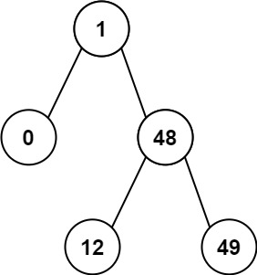

# Problem 530 - Minimum Absolute Difference in BST - Easy
Given the `root` of a Binary Search Tree (BST), return *the minimum absolute difference between the values of any two different nodes in the tree*.

 

**Example 1:**


Input: root = [4,2,6,1,3]
Output: 1

**Example 2:**



Input: root = [1,0,48,null,null,12,49]
Output: 1
 

**Constraints:**

- The number of nodes in the tree is in the range `[2, 104]`.
- `0 <= Node.val <= 10^5`

---
## Solution - C++

### 22 ms, 25.5 mb
- To solve this problem, we can first convert this BST in to a sorted array
- Then, we calculate each element inside the array to find out the minimum difference
```
int getMinimumDifference(TreeNode* root) {
    vector<int> arr;
    traverse(root, arr);
    int size = arr.size();
    int min = INT_MAX;
    for(int i = 0; i < size - 1; i++){
        if(min > abs(arr.at(i) - arr.at(i+1))){
            min = abs(arr.at(i) - arr.at(i+1));
        }
    }
    return min;
}

void traverse(TreeNode* root, vector<int>& arr){
    if(!root)
        return ;
    traverse(root->left, arr);
    arr.push_back(root->val);
    traverse(root->right, arr);
}
```
---
### 21 ms, 25.1 mb
- Improvement of the previous version without first convert BST to array
- We use two different Node pointer to calcuate the minimum difference while traversing the tree
- One pointer is called `root`, which is also required in the previous version
- Another pointer is defined as global var called `pre`, used to indicate the last tree node we've visit.
- We still traverse the tree, each time, we calculate the difference once we hit a new node, and kept minimum result.
```
TreeNode* pre = nullptr;
    
int getMinimumDifference(TreeNode* root) {
    int diff = INT_MAX;
    traverse(root, diff);
    return diff;
}

void traverse(TreeNode* root, int& diff){
    if(!root)
        return ;
    traverse(root->left, diff);
    
    if(pre){
        diff = min(diff, abs(pre->val - root->val));
    }
    pre = root;
    
    traverse(root->right, diff);
}
```